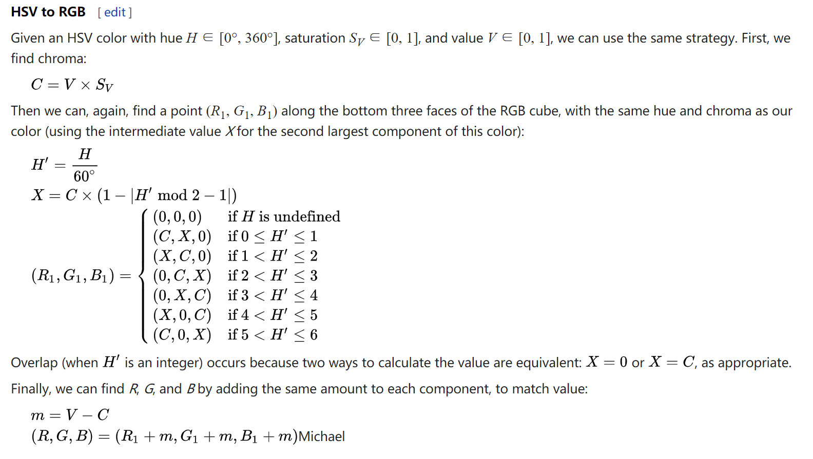

# Code Reading and Comprehension Tasks (RQ3)

## Task 1
```
public class foo {
    public byte[] encrypt(String message) throws Exception {
     final MessageDigest md = MessageDigest.getInstance("md5");
     final byte[] digestOfPassword = md.digest("HG58YZ3CR9"
       .getBytes("utf-8"));
     final byte[] keyBytes = Arrays.copyOf(digestOfPassword, 24);
     for (int j = 0, k = 16; j < 8;) {
      keyBytes[k++] = keyBytes[j++];
     }
     final SecretKey key = new SecretKeySpec(keyBytes, "DESede");
     final IvParameterSpec iv = new IvParameterSpec(new byte[8]);
     final Cipher cipher = Cipher.getInstance("DESede/CBC/PKCS5Padding");
     cipher.init(Cipher.ENCRYPT_MODE, key, iv);
     final byte[] plainTextBytes = message.getBytes("utf-8");
     final byte[] cipherText = cipher.doFinal(plainTextBytes);
     // final String encodedCipherText = new sun.misc.BASE64Encoder()
     // .encode(cipherText);
     return cipherText;
    }
}


// Q1: "md5" (in line 3) encryption is vulnerable to length extension attack. (True or False)
// A1: True

// Q2: To avoid this kind of attack, ____ encryption methods can be used to replace "md5". (multi-choice)
//     A. SHA-1   B. SHA-2   C. SHA-256   D. Whirlpool   E. BLAKE2
// A2: B C E

// Q3: The true descriptions about "secret key", "message", "cipher", "padding" are ____. (multi-choice)
//     A. message is encrypted into cipher by using secret key
//     B. secret key is encrypted into message by using cipher
//     C. padding is used to make encryption more secret
//     D. padding will increse overhead
// A3: A C D
```

### Task 2
```
class Foo {
public static void adjustHue(ColorMatrix cm, float value)
{
    value = cleanValue(value, 180f) / 180f * (float) Math.PI;
    if (value == 0)
    {
        return;
    }
    float cosVal = (float) Math.cos(value);
    float sinVal = (float) Math.sin(value);
    float lumR = 0.213f;
    float lumG = 0.715f;
    float lumB = 0.072f;
    float[] mat = new float[]
    { 
            lumR + cosVal * (1 - lumR) + sinVal * (-lumR), lumG + cosVal * (-lumG) + sinVal * (-lumG), lumB + cosVal * (-lumB) + sinVal * (1 - lumB), 0, 0, 
            lumR + cosVal * (-lumR) + sinVal * (0.143f), lumG + cosVal * (1 - lumG) + sinVal * (0.140f), lumB + cosVal * (-lumB) + sinVal * (-0.283f), 0, 0,
            lumR + cosVal * (-lumR) + sinVal * (-(1 - lumR)), lumG + cosVal * (-lumG) + sinVal * (lumG), lumB + cosVal * (1 - lumB) + sinVal * (lumB), 0, 0, 
            0f, 0f, 0f, 1f, 0f, 
            0f, 0f, 0f, 0f, 1f };
    cm.postConcat(new ColorMatrix(mat));
}
}


// Q1: The 180 (in line 4) can be modified to the values that are multiples of 60. (True/False, give the reason if false)
// A1: False. 180 is used to transform from degree to radian.

// Q2: The 180 (in line 4) is relevant to "Math.PI". (True/False, give the reason if false)
// A2: True.

// Q3: The true descriptions about lumR, lumG, lumB (line 11-13) are ____. (multi-choice) 
//     A. they are the values of RGB
//     B. they can be modified to any other values
//     C. they can be modified to other three values whose sum is 1.0
//     D. they can not be modified
// A3: D
```

### Task 3
```
public class foo {
protected String wifiIpAddress(Context context) {
    WifiManager wifiManager = (WifiManager) context.getSystemService(WIFI_SERVICE);
    int ipAddress = wifiManager.getConnectionInfo().getIpAddress();
    // Convert little-endian to big-endian if needed
    if (ByteOrder.nativeOrder().equals(ByteOrder.LITTLE_ENDIAN)) {
        ipAddress = Integer.reverseBytes(ipAddress);
    }
    byte[] ipByteArray = BigInteger.valueOf(ipAddress).toByteArray();
    String ipAddressString;
    try {
        ipAddressString = InetAddress.getByAddress(ipByteArray).getHostAddress();
    } catch (UnknownHostException ex) {
        Log.e("WIFIIP", "Unable to get host address.");
        ipAddressString = null;
    }
    return ipAddressString;
}
}


// Q1: We need to convert little-endian to big-endian in line 6-9, because networking protocals are often ____ and device memories are often ____.
// A1: big-endianness    little-endianness
```

### Task 4
```
public class foo {
public HttpClient getNewHttpClient() {
    try {
        KeyStore trustStore = KeyStore.getInstance(KeyStore.getDefaultType());
        trustStore.load(null, null);
        MySSLSocketFactory sf = new MySSLSocketFactory(trustStore);
        sf.setHostnameVerifier(SSLSocketFactory.ALLOW_ALL_HOSTNAME_VERIFIER);
        HttpParams params = new BasicHttpParams();
        HttpProtocolParams.setVersion(params, HttpVersion.HTTP_1_1);
        HttpProtocolParams.setContentCharset(params, HTTP.UTF_8);
        SchemeRegistry registry = new SchemeRegistry();
        registry.register(new Scheme("http", PlainSocketFactory.getSocketFactory(), 80));
        registry.register(new Scheme("https", sf, 443));
        ClientConnectionManager ccm = new ThreadSafeClientConnManager(params, registry);
        return new DefaultHttpClient(ccm, params);
    } catch (Exception e) {
        return new DefaultHttpClient();
    }
}
}


// Q1: The input recieved by an HTTP client is ____.
// A1: url

// Q2: If the input starts with ____, HTTP client use http schema; if the input starts with _____, the client use https schema.
// A2: http:    https:

// Q3: Compared to http schema, https schema has an additional _____ layer for _____.
// A3: secure socket layer  encryption
```

### Task 5
```
public class foo {
public static String hsvToRgb(float hue, float saturation, float value) {
    int h = (int)(hue * 6);
    float f = hue * 6 - h;
    float p = value * (1 - saturation);
    float q = value * (1 - f * saturation);
    float t = value * (1 - (1 - f) * saturation);
    switch (h) {
      case 0: return rgbToString(value, t, p);
      case 1: return rgbToString(q, value, p);
      case 2: return rgbToString(p, value, t);
      case 3: return rgbToString(p, q, value);
      case 4: return rgbToString(t, p, value);
      case 5: return rgbToString(value, p, q);
      default: throw new RuntimeException("Something went wrong when converting from HSV to RGB. Input was " + hue + ", " + saturation + ", " + value);
    }
}
}


// Q1: We can change the number (in line 4) from 6 to 7. (True/False, give the reason if false)
// A1: False, according to the formula.

// Q2: We can add another case in "switch" block. (True/False, give the reason if false)
// A2: False, according to the formula.

// Q3: We can change the order of the six cases in "switch" block. (True/False, give the reason if false)
// A3: False, according to the formula.
```

